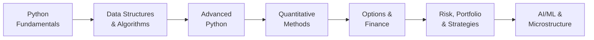

# Learn-Quant: Master Quantitative Finance & Python (v2.8.0)

[](https://github.com/MeridianAlgo/Learn-Quant/actions/workflows/lint.yml)
[](https://github.com/MeridianAlgo/Learn-Quant/actions/workflows/autoformat.yml)
[](https://meridianalgo.github.io/Learn-Quant/)
[](https://opensource.org/licenses/MIT)
[](https://www.python.org/)
[](https://meridianalgo.github.io/Learn-Quant/modules/)
[](z_tests/)

**Welcome to Learn-Quant** — your all-in-one, open-source toolkit for mastering algorithmic trading, quantitative finance theory, and professional Python engineering. Every folder is a fully self-contained lesson: run it, read it, extend it.

### 📖 Read the docs: **[meridianalgo.github.io/Learn-Quant](https://meridianalgo.github.io/Learn-Quant/)**

The documentation site is the best way to explore Learn-Quant — searchable, with
curated [learning paths](https://meridianalgo.github.io/Learn-Quant/learning-paths/),
a [glossary](https://meridianalgo.github.io/Learn-Quant/glossary/), per-module
difficulty badges and copy-paste run commands.

---

## What is New in v2.8.0

- **Four new modules**, each documented, commented and unit-tested:
  - `Python Basics - Dates and Times` — trading-day counting (weekends + holidays), T+N settlement, and the ACT/365, ACT/360 and 30/360 day-count conventions
  - `Quantitative Methods - Numerical Methods` — bisection, Newton-Raphson and secant root finders, central-difference derivatives, and trapezoid/Simpson integration, all from first principles
  - `Quantitative Methods - Bayesian Inference` — Beta-Binomial and Normal-Normal conjugate updating, credible intervals, and shrinkage of noisy return estimates
  - `Machine Learning - K-Means Clustering` — k-means++ from scratch, inertia/elbow and silhouette scoring to choose `k`, applied to asset clustering
- **Spans the curriculum**: these lessons reach from a Level 1 Python fundamentals topic (dates) through the numerical and statistical machinery (Level 4) to unsupervised ML (Level 7)
- **Docs auto-extend**: the new folders are picked up by the docs builder — badges, run commands and "see also" links included — and pass `mkdocs build --strict`
- **Test suite grows**: 46 new unit tests bring the suite to **505 passing** (up from 459)

### Previous Releases
| Version | Highlights |
|---|---|
| v2.7.0 | Backtesting Engine, Extreme Value Theory, Implied Vol Surface, Feature Engineering; docs site overhaul; suite repaired to 459 tests |
| v2.6.0 | Risk Parity, PCA, Bootstrap, Information Ratio modules |
| v2.5.0 | Full README coverage for all v2.4.0 modules; auto-format workflow; docs builder overhaul |
| v2.4.0 | NumPy, Pandas, Comprehensions tutorials; Black-Scholes JS, Monte Carlo JS |
| v2.3.0 | GARCH, Cointegration, Performance Attribution, Stress Testing, Trend Following |
| v2.2.0 | 13 quant finance modules: Kelly, FX, Exotic Options, Black-Litterman, Regime Detection |
| v2.1.0 | Four interactive quiz-based tutorials (statistics, options, risk, portfolio) |
| v2.0.0 | Performance Analysis utils: Hurst, Omega, Tail, Gain-Pain |

---

## Overview

Learn-Quant is a curated collection of **113 self-contained modules** designed to bridge the gap between academic theory and production-grade code. Whether you are a student, a software engineer moving into finance, or a trader learning to code, this repository gives you the building blocks to go from Python fundamentals all the way to HFT execution systems and ML-driven strategies.

### Key Learning Outcomes
- **Master Quant Strategies**: Pairs Trading, Momentum, Mean Reversion, Market Making, Statistical Arbitrage
- **Engineer Robust Systems**: AsyncIO, Context Managers, Decorators, Multiprocessing, Error Handling
- **Deep Dive into Math**: Kalman Filters, Stochastic Processes, GARCH, Cointegration, Copulas, Factor Models
- **Build Core Tools**: Option Pricers, Risk Engines, Portfolio Optimizers, Backtesting Simulators
- **CS Algorithms**: Sorting, Graph Theory, Dynamic Programming, Backtracking applied to market data
- **Modern ML**: Random Forests, Time-Series ML, Reinforcement Learning, Sentiment Analysis

---

## Complete Module Directory

### Level 1 — Python Fundamentals
*Essential coding skills for financial analysis. Start here if you are new to Python.*

| Module | What you will learn |
|---|---|
| `Python Basics - Numbers` | Floating point precision, decimal module for currency math, compound interest |
| `Python Basics - Strings` | Ticker manipulation, string formatting, news headline parsing |
| `Python Basics - Control Flow` | Trading logic, conditional rules, loop patterns for time-series |
| `Python Basics - Functions` | Building reusable quant libraries, closures, type hints |
| `Python Basics - NumPy` | Arrays, vectorised returns, broadcasting, covariance, portfolio variance |
| `Python Basics - Pandas` | DataFrames, resampling, rolling windows, groupby, SMA crossover backtest |
| `Python Basics - Comprehensions` | List/dict/set comprehensions, generators, map/filter/reduce, accumulate |
| `Python Basics - Dates and Times` | Trading-day counting, T+N settlement, ACT/365, ACT/360 and 30/360 day-count conventions |

---

### Level 2 — Data Structures & Algorithms
*Optimising performance and implementing classical CS techniques on market data.*

**Data Structures**

| Module | What you will learn |
|---|---|
| `Data Structures - Arrays` | NumPy array ops, time-series slicing, OHLCV matrix manipulation |
| `Data Structures - Lists` | Dynamic portfolio lists, deque for order books, tick-by-tick storage |
| `Data Structures - Dictionaries` | Hash maps for symbol lookups, order routing tables, config stores |
| `Data Structures - Tuples and Sets` | Immutable records, set operations for universe filtering |

**Algorithms**

| Module | What you will learn |
|---|---|
| `Algorithms - Sorting` | Quicksort, Mergesort, Timsort benchmarks on market data |
| `Algorithms - Searching` | Binary search on sorted time-series, interpolation search |
| `Algorithms - Tree` | BST, heap-based priority queues for order books |
| `Algorithms - Graph` | Arbitrage detection via shortest paths (Bellman-Ford) |
| `Algorithms - Dynamic Programming` | Optimal execution paths, knapsack-style position sizing |
| `Algorithms - Backtracking` | Constraint-based portfolio construction, combinatorial search |
| `Algorithms - String` | Pattern matching on tick data, FIX message parsing helpers |
| `Algorithms - Machine Learning` | Classical ML algorithms from scratch: k-NN, decision trees, gradient descent |

---

### Level 3 — Advanced Python Engineering
*Writing professional, production-ready financial systems.*

| Module | What you will learn |
|---|---|
| `Advanced Python - OOP` | Scalable Trading Engines and Portfolio Managers using classes and inheritance |
| `Advanced Python - AsyncIO` | High-throughput async data pipelines, concurrent order submission |
| `Advanced Python - Context Managers` | Database locks, atomic transactions, resource cleanup in trading systems |
| `Advanced Python - Decorators and Generators` | Custom logging wrappers, timing decorators, lazy price-stream generators |
| `Advanced Python - Error Handling` | Robust systems that never crash mid-trade: retry logic, circuit breakers |
| `Advanced Python - Multiprocessing` | Parallel Monte Carlo, parallel backtests, parameter sweeps across all CPU cores |

---

### Level 4 — Quantitative Methods
*The mathematics underpinning modern finance.*

| Module | What you will learn |
|---|---|
| `Quantitative Methods - Statistics` | Hypothesis testing, stationarity tests, cointegration, Z-scores, fat tails — includes interactive quiz |
| `Quantitative Methods - Regression Analysis` | OLS, GLS, factor regressions, residual diagnostics |
| `Quantitative Methods - Linear Algebra` | Matrix decompositions for portfolio optimisation, PCA, eigenvalues |
| `Quantitative Methods - Factor Models` | Fama-French 3-factor, factor regression, alpha decomposition, performance attribution |
| `Quantitative Methods - Time Series` | ARIMA, ACF/PACF, stationarity, forecasting |
| `Quantitative Methods - Stochastic Processes` | GBM, Ornstein-Uhlenbeck, Brownian Bridge, Heston model |
| `Quantitative Methods - GARCH` | EWMA, GARCH(1,1) MLE fitting, multi-step volatility forecasting |
| `Quantitative Methods - Cointegration` | ADF unit-root, Engle-Granger two-step, OU half-life, rolling z-score for pairs |
| `Quantitative Methods - Kalman Filter` | Dynamic hedge ratios, noise filtering, state-space models |
| `Quantitative Methods - Optimization` | Convex optimisation, quadratic programming, scipy.optimize for portfolio problems |
| `Quantitative Methods - Performance Analysis` | Hurst Exponent, Omega Ratio, Tail Ratio, Gain-Pain, active return metrics |
| `Quantitative Methods - Copulas` | Gaussian and t-copulas, tail dependence, joint return simulation |
| `Quantitative Methods - Interest Rate Models` | Vasicek, CIR, Hull-White short rate models |
| `Quantitative Methods - Regime Detection` | Hidden Markov Models, changepoint detection, bull/bear regime classification |
| `Quantitative Methods - TVM` | Time Value of Money: PV, FV, NPV, IRR, bond pricing foundations |
| `Quantitative Methods - Principal Component Analysis` | PCA from scratch, yield-curve level/slope/curvature, factor extraction, covariance de-noising |
| `Quantitative Methods - Bootstrap` | i.i.d., block, and stationary bootstrap; confidence intervals for Sharpe and other backtest metrics |
| `Quantitative Methods - Extreme Value Theory` | Peaks-Over-Threshold GPD fitting, EVT VaR/ES for the deep tail, Hill tail-index estimator |
| `Quantitative Methods - Numerical Methods` | Bisection, Newton-Raphson, secant root finders; central differences; trapezoid and Simpson integration |
| `Quantitative Methods - Bayesian Inference` | Beta-Binomial and Normal-Normal conjugate updating, credible intervals, shrinkage of noisy estimates |

---

### Level 5 — Options, Derivatives & Finance
*Pricing, Greeks, valuation, and core financial instruments.*

**Options & Derivatives**

| Module | What you will learn |
|---|---|
| `Black-Scholes Option Pricing` | European call/put pricing, all five Greeks, implied vol — includes interactive tutorial |
| `Advanced Options Pricing` | Binomial trees, finite-difference methods, American options |
| `Options Pricing - JavaScript` | Full Black-Scholes in pure JS: price, Greeks, IV bisection solver |
| `Finance - Greeks Calculator` | Delta, Gamma, Theta, Vega, Rho across a full options chain |
| `Finance - Exotic Options` | Barriers, Asian, Lookback, Digital — analytical and Monte Carlo pricing |
| `Finance - Implied Volatility Surface` | Black-Scholes IV inversion (Newton + bisection), bilinear vol surface, skew and term structure |
| `Finance - Options Strategies` | Spreads, straddles, strangles, condors — payoff diagrams and breakeven analysis |
| `Options Chain Simulator` | Synthetic options chain generation with vol surface interpolation |
| `Technical Indicators` | SMA, EMA, RSI (Wilder), MACD, Bollinger Bands, ATR — Python and JavaScript |
| `Monte Carlo Simulation - JavaScript` | GBM paths, correlated multi-asset portfolio MC, antithetic variates, VaR/CVaR |

**Fixed Income & Valuation**

| Module | What you will learn |
|---|---|
| `Bond Price and Yield` | Yield-to-maturity, duration, convexity, zero-coupon and coupon bonds |
| `Finance - Duration Convexity` | Modified/effective duration, convexity adjustment, immunisation |
| `Finance - Yield Curve` | Nelson-Siegel fitting, forward rate extraction, curve shape classification |
| `Discounted Cash Flow (DCF)` | DCF valuation, terminal value, sensitivity analysis |
| `CAPM` | Capital Asset Pricing Model, beta estimation, security market line |
| `Finance - Beta Calculator` | Rolling beta, market beta vs. sector beta |
| `Finance - Correlation Analysis` | Pearson and Spearman correlation, rolling correlation, correlation heatmaps |
| `Finance - Covariance Estimation` | Sample, shrinkage (Ledoit-Wolf), and robust covariance estimators |
| `Finance - Credit Risk` | PD/LGD/EAD framework, Merton model, credit spreads |
| `Finance - Volatility Calculator` | Parkinson, Garman-Klass, EWMA volatility estimators |
| `Finance - Kelly Criterion` | Full Kelly, fractional Kelly, continuous Kelly for multi-asset portfolios |
| `Finance - Position Sizing` | Fixed fractional, volatility targeting, risk of ruin analysis |
| `Finance - Transaction Cost Analysis` | Implementation shortfall, VWAP slippage, market impact models |
| `Finance - FX Tools` | Spot/forward rates, PPP, interest rate parity, triangular arbitrage |
| `Finance - Expected Shortfall` | ES (CVaR) calculation, parametric and historical methods |
| `Dividend Tracker` | Dividend yield, growth rate modelling, dividend discount model |

---

### Level 6 — Risk, Portfolio & Strategies
*Applied quantitative finance: measure risk, build portfolios, run strategies.*

**Risk & Performance**

| Module | What you will learn |
|---|---|
| `Risk Metrics` | VaR, CVaR, Drawdown, Sortino Ratio — includes interactive tutorial with quizzes |
| `Risk Metrics - Drawdown Analysis` | Max drawdown, drawdown duration, Calmar ratio, underwater equity curves |
| `Risk Metrics - Stress Testing` | 2008 GFC, 2020 COVID, 1987 crash, dotcom, 2022 scenarios; sensitivity analysis |
| `Value at Risk (VaR)` | Parametric, historical, and Monte Carlo VaR; backtesting and Kupiec test |
| `Sharpe and Sortino Ratio` | Risk-adjusted return metrics, annualisation, rolling Sharpe |
| `Finance - Performance Attribution` | Brinson-Hood-Beebower allocation/selection/interaction decomposition |
| `Finance - Information Ratio` | Active return, tracking error, Information Ratio, CAPM-based appraisal ratio |
| `Finance - Expected Shortfall` | ES/CVaR: parametric, historical, and Monte Carlo approaches |

**Portfolio Management**

| Module | What you will learn |
|---|---|
| `Portfolio Optimizer` | Efficient Frontier, max-Sharpe, min-variance, Markowitz — includes interactive tutorial |
| `Portfolio Tracker` | Position tracking, P&L attribution, multi-asset portfolio dashboard |
| `Portfolio Management` | Portfolio construction, rebalancing rules, turnover constraints |
| `Portfolio Management - Black Litterman` | Black-Litterman model, investor views, posterior allocation |
| `Portfolio Management - Risk Parity` | Inverse-volatility, Equal Risk Contribution (ERC), and custom risk-budget portfolios |
| `Monte Carlo Portfolio Simulator` | Multi-path portfolio simulation, probability-of-ruin, wealth distribution |

**Strategies**

| Module | What you will learn |
|---|---|
| `Strategies - Pairs Trading` | Cointegration-based stat arb, spread z-score entry/exit, hedge ratio |
| `Strategies - Momentum Trading` | Cross-sectional and time-series momentum, signal generation, backtest |
| `Strategies - Mean Reversion` | Bollinger Band + RSI signals, Ornstein-Uhlenbeck process, reversion-to-mean |
| `Strategies - Trend Following` | Donchian channel, MA crossover, ATR-based volatility position sizing |
| `Strategies - Market Making` | Bid/ask spread optimisation, inventory management, Avellaneda-Stoikov |
| `Strategies - Statistical Arbitrage` | Factor-neutral stat arb, residual momentum, cross-sectional z-score |
| `Strategies - Backtesting Engine` | Look-ahead-free, cost-aware vectorised backtester; CAGR, Sharpe, Sortino, drawdown, Calmar, turnover |
| `Order Execution Simulator` | VWAP, TWAP, POV execution algorithms; market impact simulation |

---

### Level 7 — AI, ML & Market Microstructure
*Modern data-driven approaches and low-latency market structure.*

**Machine Learning & AI**

| Module | What you will learn |
|---|---|
| `Machine Learning - Feature Engineering` | Stationary feature matrix, RSI/momentum/volatility, triple-barrier labels, leak-free purged split |
| `Machine Learning - K-Means Clustering` | k-means++ from scratch, inertia/elbow and silhouette to choose k, asset clustering |
| `Machine Learning - Random Forest` | Random forests for return prediction, feature importance, walk-forward CV |
| `Machine Learning Time Series` | LSTM, gradient boosting on financial time-series, train/test discipline |
| `Reinforcement Learning Q Learning` | Q-learning trading agent, reward engineering, policy evaluation |
| `AI Development` | Integrating LLMs and ML models into trading pipelines |
| `Sentiment Analysis on News` | NLP for fundamental analysis, FinBERT, news-driven signals |

**Data & Connectivity**

| Module | What you will learn |
|---|---|
| `Market Data` | Historical and real-time data ingestion, cleaning, normalisation |
| `Historical Data` | JavaScript module for fetching and processing historical price data |
| `News Fetching` | JavaScript module for scraping and structuring financial news |
| `Websocket Connection` | Real-time market data streaming, reconnection logic |
| `Learning Platform` | Interactive CLI learning platform with progress tracking |

**Market Microstructure & HFT**

| Module | What you will learn |
|---|---|
| `Market Microstructure` | Order book implementation, spread analysis, market impact models |
| `High Frequency Trading` | Latency optimisation, co-location considerations, HFT execution strategies |

**Utilities & Tools**

| Module | What you will learn |
|---|---|
| `Core Utilities` | Shared helpers: date utils, config loaders, math primitives |
| `Data Processing` | Cleaning, normalising, resampling raw market data at scale |
| `Logging` | Structured logging for trading systems in Python and JavaScript |
| `System Utilities` | Process management, environment introspection, cross-platform helpers |
| `Currency Converter` | Real-time and historical FX conversion utilities |
| `Economic Calendar` | Macro event calendar parsing and impact classification |
| `Finance - Transaction Cost Analysis` | TCA pipeline: slippage measurement, benchmark comparison |

---

## Usage

### Installation
```bash
git clone https://github.com/MeridianAlgo/Learn-Quant
cd Learn-Quant
pip install -r requirements.txt
```

### Running a Module
Navigate to any directory and run the script directly. All modules are self-contained.

```bash
# Python Basics
cd "Python Basics - NumPy"
python numpy_tutorial.py

# Quantitative methods
cd "Quantitative Methods - GARCH"
python garch_model.py

# Options pricing
cd "Black-Scholes Option Pricing"
python black_scholes.py

# Strategies
cd "Strategies - Pairs Trading"
python pairs_trading.py

# Portfolio construction
cd "Portfolio Management - Risk Parity"
python risk_parity.py

# Bootstrap confidence intervals
cd "Quantitative Methods - Bootstrap"
python bootstrap.py

# Backtest a strategy
cd "Strategies - Backtesting Engine"
python backtest_engine.py

# Cluster assets with k-means (new in v2.8.0)
cd "Machine Learning - K-Means Clustering"
python kmeans_clustering.py

# JavaScript modules (requires Node.js)
cd "Options Pricing - JavaScript"
node blackScholes.js

cd "Monte Carlo Simulation - JavaScript"
node monteCarlo.js
```

### Recommended Learning Path
```
Level 1 → Level 2 → Level 3 → Level 4 → Level 5 → Level 6 → Level 7
```



Each level builds on the last. Complete the interactive tutorials (files ending in `_tutorial.py`) inside each module for quizzes and worked examples.

Prefer a goal-driven route? The docs site has curated **[learning paths](https://meridianalgo.github.io/Learn-Quant/learning-paths/)** for options traders, quant researchers, ML engineers and portfolio managers.

---

## Repository Stats

| Category | Count |
|---|---|
| Total modules | 113 |
| Python lesson files | 127 |
| JavaScript modules | 7 |
| Modules with interactive tutorials | 4 |
| Test files | 71 |
| Tests passing | 505 |

---

## Contributing
Contributions are welcome.
- **Found a bug?** Open an Issue.
- **Have a new strategy?** Fork the repo and submit a Pull Request.
- **Documentation improvements?** We love those too.

---

### License
This project is open-sourced under the MIT License.

---

**Learn-Quant v2.8.0**
*Quantitative Finance | Algorithmic Trading | Python Mastery*
**Maintained by MeridianAlgo**
