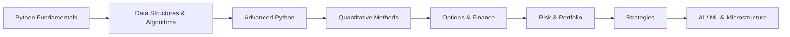

---
hide:
  - navigation
  - toc
---

<div class="lq-hero" markdown>

# Learn-Quant

### Master quantitative finance, algorithmic trading and professional Python — one runnable lesson at a time.

113 self-contained modules · 127 Python files · 7 JavaScript modules · MIT licensed

[:material-rocket-launch-outline: Get started](getting-started.md){ .md-button .md-button--primary }
[:material-map-outline: Learning paths](learning-paths.md){ .md-button }
[:simple-github: Star on GitHub](https://github.com/MeridianAlgo/Learn-Quant){ .md-button }

</div>

## Why Learn-Quant?

<div class="grid cards" markdown>

-   :material-play-circle-outline:{ .lg .middle } __Every folder runs__

    ---

    No frameworks to install, no notebooks to wire up. Each module is a single
    folder you can run from the command line and read top to bottom.

-   :material-book-open-page-variant-outline:{ .lg .middle } __Theory *and* code__

    ---

    The maths is explained, then implemented from first principles — you see the
    formula and the line of code that makes it real.

-   :material-stairs:{ .lg .middle } __A real curriculum__

    ---

    Seven levels take you from `print("hello")` to GARCH volatility models,
    Black-Litterman allocation and reinforcement-learning agents.

-   :material-test-tube:{ .lg .middle } __Tested & linted__

    ---

    Modules ship with unit tests and pass `ruff` in CI, so the code you learn
    from is the code you can trust.

</div>

## Explore by topic

<div class="grid cards" markdown>

-   :material-language-python:{ .lg .middle } __Python Fundamentals__

    ---

    Core Python for financial analysis — start here if you are new to code.

    [:octicons-arrow-right-24: 8 modules](Python Basics - Comprehensions.md)

-   :material-database-outline:{ .lg .middle } __Data Structures__

    ---

    The right container for the job: arrays, lists, dicts, sets on market data.

    [:octicons-arrow-right-24: 4 modules](Data Structures - Arrays.md)

-   :material-sitemap-outline:{ .lg .middle } __Algorithms__

    ---

    Classic computer-science algorithms applied to price and order data.

    [:octicons-arrow-right-24: 8 modules](Algorithms - Backtracking.md)

-   :material-cog-outline:{ .lg .middle } __Advanced Python__

    ---

    Production engineering: async, OOP, concurrency, resilient error handling.

    [:octicons-arrow-right-24: 6 modules](Advanced Python - AsyncIO.md)

-   :material-function-variant:{ .lg .middle } __Quantitative Methods__

    ---

    The mathematics underpinning modern finance, implemented from first principles.

    [:octicons-arrow-right-24: 20 modules](Quantitative Methods - Bayesian Inference.md)

-   :material-chart-bell-curve:{ .lg .middle } __Options, Derivatives & Finance__

    ---

    Pricing, Greeks, fixed income and valuation of financial instruments.

    [:octicons-arrow-right-24: 26 modules](Advanced Options Pricing.md)

-   :material-shield-alert-outline:{ .lg .middle } __Risk & Performance__

    ---

    Measure what can go wrong and how well a strategy actually performed.

    [:octicons-arrow-right-24: 7 modules](Finance - Information Ratio.md)

-   :material-briefcase-outline:{ .lg .middle } __Portfolio Management__

    ---

    Construct, optimise and rebalance multi-asset portfolios.

    [:octicons-arrow-right-24: 6 modules](Monte Carlo Portfolio Simulator.md)

-   :material-trending-up:{ .lg .middle } __Strategies__

    ---

    End-to-end trading strategies with signals, backtests and execution.

    [:octicons-arrow-right-24: 8 modules](Order Execution Simulator.md)

-   :material-robot-outline:{ .lg .middle } __AI & Machine Learning__

    ---

    Data-driven models: random forests, deep learning, RL and NLP for markets.

    [:octicons-arrow-right-24: 8 modules](AI Development.md)

-   :material-pulse:{ .lg .middle } __Market Microstructure__

    ---

    Order books, spreads and the low-latency mechanics of how trades happen.

    [:octicons-arrow-right-24: 2 modules](High Frequency Trading.md)

-   :material-tools:{ .lg .middle } __Utilities & Tools__

    ---

    The plumbing: data ingestion, logging, FX, calendars and helpers.

    [:octicons-arrow-right-24: 10 modules](Core Utilities.md)

</div>

## A guided path



New here? Follow the [recommended learning paths](learning-paths.md) — curated
sequences for beginners, options traders, quant researchers and ML engineers.

## Quick start

```bash
git clone https://github.com/MeridianAlgo/Learn-Quant
cd Learn-Quant
pip install -r requirements.txt

# run any module, e.g.
cd "Quantitative Methods - GARCH"
python garch.py
```

See the [Getting Started guide](getting-started.md) for the full setup, or jump
straight to the [complete module index](modules.md).
