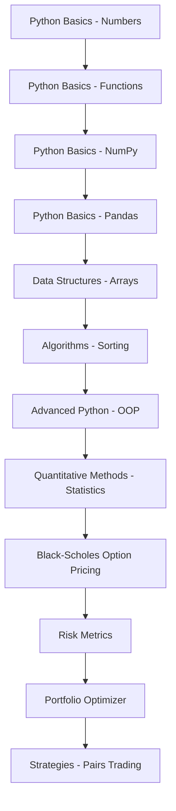

# Learning Paths

Pick the track that matches your goal. Each path is an ordered sequence of
modules — finish one before moving to the next.

## :material-school-outline: Complete Beginner → Quant Developer

The full curriculum, in order. Budget a few weeks and you will go from basic
syntax to pricing derivatives and backtesting strategies.

## :material-chart-bell-curve: Options & Derivatives Trader

For traders who want to understand pricing and risk:

1. [Python Basics - NumPy](Python Basics - NumPy.md)
2. [Quantitative Methods - Stochastic Processes](Quantitative Methods - Stochastic Processes.md)
3. [Black-Scholes Option Pricing](Black-Scholes Option Pricing.md)
4. [Finance - Greeks Calculator](Finance - Greeks Calculator.md)
5. [Advanced Options Pricing](Advanced Options Pricing.md)
6. [Finance - Exotic Options](Finance - Exotic Options.md)
7. [Finance - Implied Volatility Surface](Finance - Implied Volatility Surface.md)
8. [Finance - Options Strategies](Finance - Options Strategies.md)

## :material-function-variant: Quant Researcher

For the statistically minded building signals and models:

1. [Quantitative Methods - Statistics](Quantitative Methods - Statistics.md)
2. [Quantitative Methods - Regression Analysis](Quantitative Methods - Regression Analysis.md)
3. [Quantitative Methods - Time Series](Quantitative Methods - Time Series.md)
4. [Quantitative Methods - GARCH](Quantitative Methods - GARCH.md)
5. [Quantitative Methods - Cointegration](Quantitative Methods - Cointegration.md)
6. [Quantitative Methods - Extreme Value Theory](Quantitative Methods - Extreme Value Theory.md)
7. [Strategies - Statistical Arbitrage](Strategies - Statistical Arbitrage.md)
8. [Strategies - Backtesting Engine](Strategies - Backtesting Engine.md)

## :material-robot-outline: ML / AI Engineer

For applying machine learning to markets:

1. [Python Basics - Pandas](Python Basics - Pandas.md)
2. [Algorithms - Machine Learning](Algorithms - Machine Learning.md)
3. [Machine Learning - Feature Engineering](Machine Learning - Feature Engineering.md)
4. [Machine Learning - Random Forest](Machine Learning - Random Forest.md)
5. [Machine Learning Time Series](Machine Learning Time Series.md)
6. [Reinforcement Learning Q Learning](Reinforcement Learning Q Learning.md)
7. [Sentiment Analysis on News](Sentiment Analysis on News.md)

## :material-briefcase-outline: Portfolio & Risk Manager

For allocation, risk budgeting and performance measurement:

1. [CAPM](CAPM.md)
2. [Finance - Covariance Estimation](Finance - Covariance Estimation.md)
3. [Portfolio Optimizer](Portfolio Optimizer.md)
4. [Portfolio Management - Risk Parity](Portfolio Management - Risk Parity.md)
5. [Portfolio Management - Black Litterman](Portfolio Management - Black Litterman.md)
6. [Risk Metrics](Risk Metrics.md)
7. [Value at Risk (VaR)](Value at Risk (VaR).md)
8. [Finance - Information Ratio](Finance - Information Ratio.md)

!!! tip
    Not sure where you sit? Start with
    [Python Basics - NumPy](Python Basics - NumPy.md) and
    [Quantitative Methods - Statistics](Quantitative Methods - Statistics.md) —
    they are the backbone every other path leans on.
